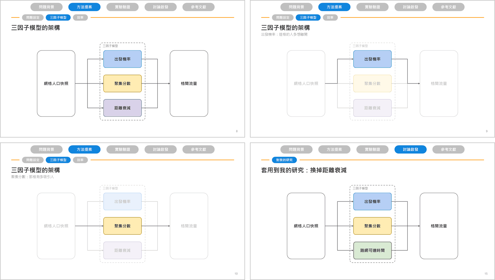
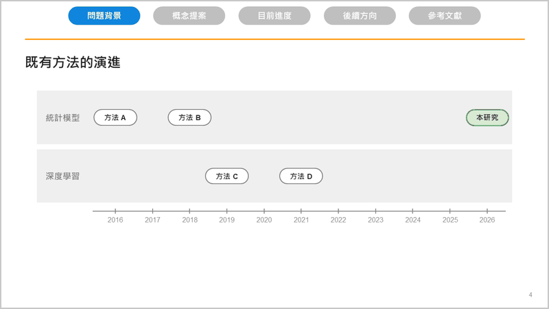

# 架構圖、漸進聚焦、時間軸

## 架構圖與漸進聚焦

**架構圖**是你自己整理出來的概念架構（不是重畫論文的圖），用 PowerPoint 原生的方塊與箭頭繪製，一頁滿版：

- 連線黏在方塊上，在 PowerPoint 裡拖動方塊，箭頭會跟著走。
- 可以用虛線模組框框住一組元件，方塊裡也可以放縮圖。
- 同一張圖可以跨頁沿用，位置完全不動：只把新加入或換掉的元件標成綠色（右下圖）。

**漸進聚焦**：同一張架構圖或論文截圖要講好幾個重點時，展開成好幾頁，先一頁全貌，再每頁只亮一塊、其餘淡化
（上圖左上 → 右上 → 左下）。論文截圖的順序會照論文描述那張圖的順序，例如 (a) → (b) → (c)。

- 例：「把三因子模型畫成架構圖，逐一講出發機率、聚集分數、距離衰減」。
- 例：「Figure 3 依 (a)(b)(c) 逐一聚焦」。
- 聚焦是「展開說明」，紅框是「單頁重點」，所以聚焦的頁面不會放紅框。

## 時間軸

交代領域怎麼演進、本文站在哪裡：底部是年份，每個分類一條水平色帶，模型用小膠囊標在年份上，本文用綠框標出。

- 年份只標到「年」，而且要有來源（論文的相關研究或參考文獻），不確定的不放。
- 例：「過往研究加一頁時間軸，分統計模型與深度學習兩類」。
