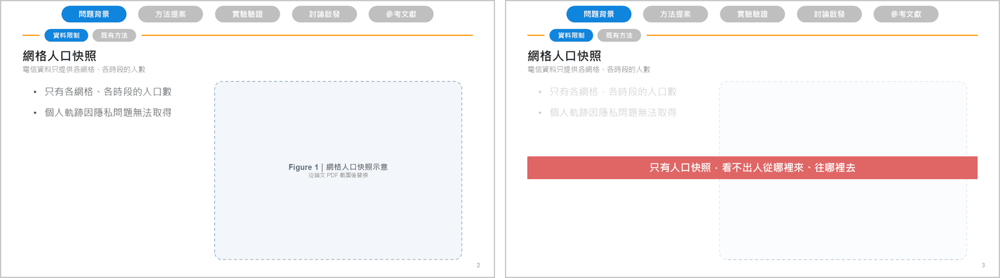
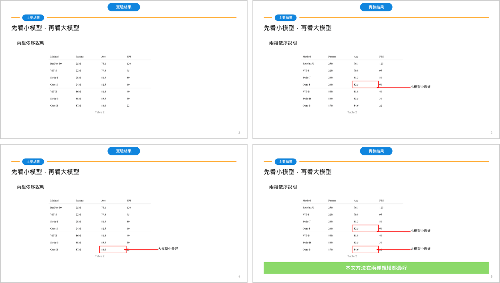

# 強調重點：結論橫條與截圖標註

報告時先講內容、再點出結論；截圖上的重點一個一個帶出來。這些都做成 PowerPoint 的點擊動畫，
也可以改成不用動畫的版本（見最後一節）。

## 結論橫條

- 講完這一頁點一下：內容被半透明白底淡化，結論橫條出現在中間。
- 顏色對應語氣：**紅＝問題**、**綠＝正向成果**、**藍＝中性整理**。
- 例：「第 3 頁加結論：只有人口快照，看不出人往哪裡去」。

## 截圖標註

在論文截圖上疊加三種標註：**紅框**（圈出重點數值）、**色塊**（標出一組列）、**說明**（一句話加箭頭）。

- 可以一個一個出現，講完讓它消失、換下一個（「出現→消失」算一組）。
- **最後一下所有標註會一起回來**，和下方的統整橫幅同時出現，這一頁就停在「全部重點都在」的畫面。
- 一頁最多 3 組標註，太多就拆頁。
- 例：「Table 2 的 82.5 和 84.6 各加紅框，先講小模型再講大模型，最後結論：本文方法在兩種規模都最好」。

標註的位置是 Claude 看截圖估的，可能需要你在 PowerPoint 裡微調。

## 不用動畫的版本

匯出 PDF 或上傳 Google 簡報時，跟 Claude 說「給我不用動畫的版本」。每一下點擊會拆成一頁，
翻頁的效果就像動畫；上面兩張圖就是這個版本的畫面。
