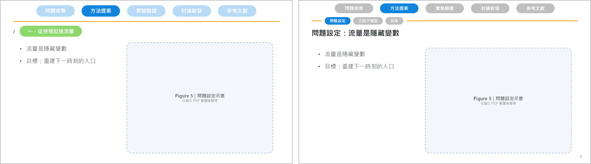
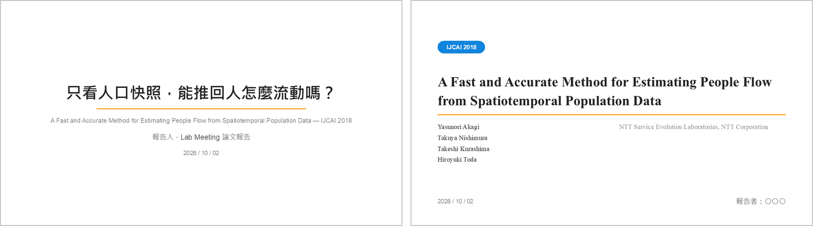

# 簡報風格：導覽列、封面、密度

2slide 依實驗室的兩種簡報風格產生初稿。導覽列、密度、封面都可以各自切換，同一份內容不用重寫。

## 單排與雙排

| | 單排 | 雙排 |
|---|---|---|
| 適合 | 研究提案、進度報告 | 論文報告 |
| 導覽列 | 一排章節分頁 | 章節分頁＋嵌在橘線上的子章節 |
| 章節 | 章節本身就是故事線 | 通用章節（介紹／研究方法／實驗結果／結論），故事線放在子章節 |
| 頁面標題 | 「/ 彩色標籤」（紅＝問題、綠＝解法、藍＝中性） | 黑字標題，可加一行灰色說明 |
| 頁碼 | 無 | 右下角 |

跟 Claude 說「換成單排」「改成雙排」就能切換。

## 兩種封面

- **置中**（單排預設）：標題、橘線、作者與用途。
- **論文**（雙排預設）：會議徽章、論文標題、作者與機構、右下角報告者。

## 三種密度

| 密度 | 內容 | 適合 |
|---|---|---|
| 文字型 | 完整段落＋「本頁重點」框 | 給人自己翻閱的版本 |
| 平衡型 | 條列＋右側圖 | 一般報告 |
| 圖像型 | 一句話＋滿版圖 | 口頭報告、圖多的論文 |

跟 Claude 說「改成圖像型」或「三種密度都給我」。完整說明留在講者備註，刪減投影片上的文字也不會遺失內容。

## 配色

- 紅色只代表問題、綠色只代表解法。
- 論文裡有界線明確、需要反覆對照的概念時（例如「圖像層級／區域層級」），才會另外指定概念色，整份簡報不換色；沒有就不用。
- 每次產生簡報都會附上「色彩對照表」，列出每個顏色代表什麼、出現在哪幾頁，方便你之後修改時沿用。

詳細欄位見 [`skills/2slide/references/spec.md`](../skills/2slide/references/spec.md)，視覺規範見 [`style.md`](../skills/2slide/references/style.md)。
